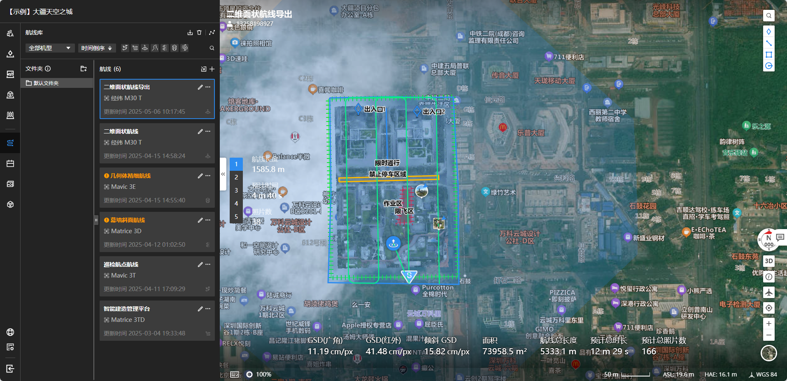

# wpml_codec
大疆 WPML 航线文件编解码器

## 示例
简单使用参考示例代码 [sample/main.cpp](https://github.com/geoyee/wpml_codec/blob/main/sample/main.cpp)，示例数据以及生成的结果查看，可以使用[大疆司空 2](https://fh.dji.com/)在线平台

## 参考
- https://developer.dji.com/doc/cloud-api-tutorial/cn/api-reference/dji-wpml/overview.html
